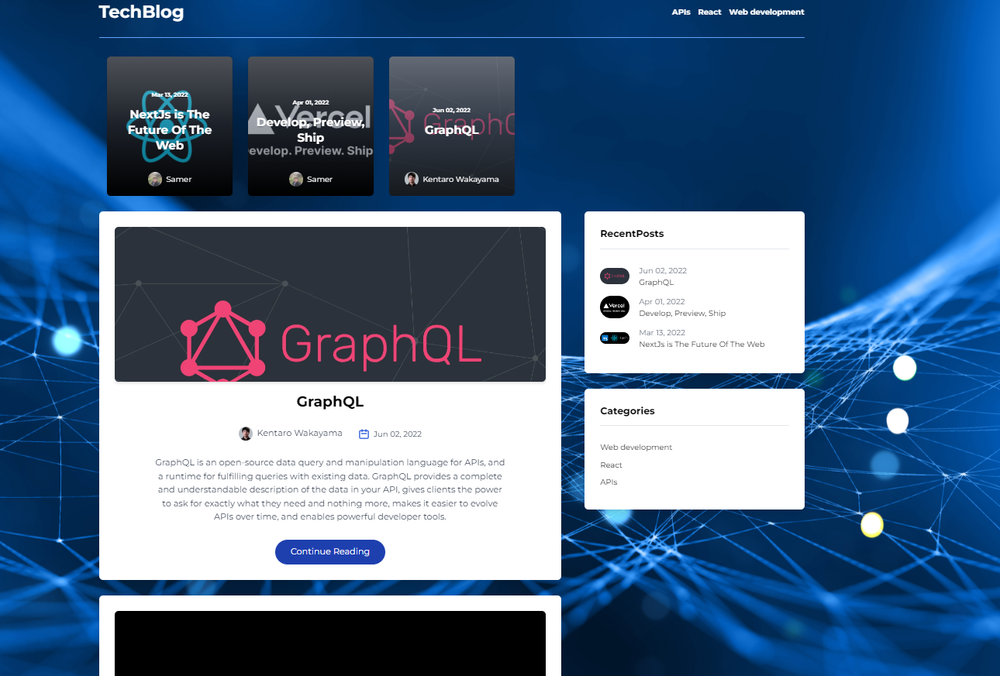
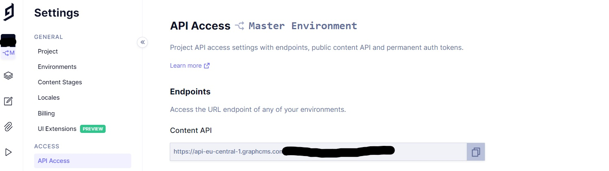
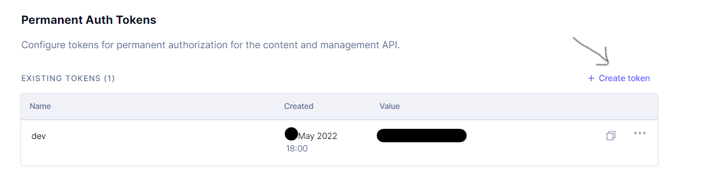

# GraphCMS Headless Blog

### <a href="https://blog-project-samermaz.vercel.app/" target="_blank">Live Site</a>

## Description
CMS Blog Application With featured and recent posts, categories, full markdown articles, author information, comments a fully responsive Application. It's a tutorial from
<a href="https://github.com/adrianhajdin/project_graphql_blog" target="_blank">adrianhajdin </a> know as javascriptmastery on youtube he build the project using **NextJs**, **TailwindCSS**, **GraphQL** and **GraphCMS** and **Vercel** for deploying.
GraphCMS is a headless content management system based on GraphQL technology enabling seamless integration with any application. It's a great <a href="https://www.youtube.com/watch?v=HYv55DhgTuA" target="_blank">tutorial </a> where i learned the technologies mentioned and try to make it more challenged with adding **Typescript** to it.     

## How to Install and Run the Project
- Open your terminal and then type. `$ git clone {the url to the GitHub repo}`  
- cd into the new folder and type. `$ npm install`  
- To run the project. `$ npm run dev`

- create a .env file and add as shown in the .env.example file the following Endpoint and Token in https://app.graphcms.com/ *settings/api-access* after creating an account on graphcms.

     
